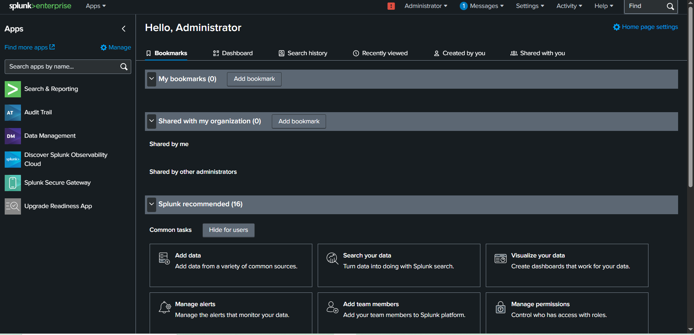
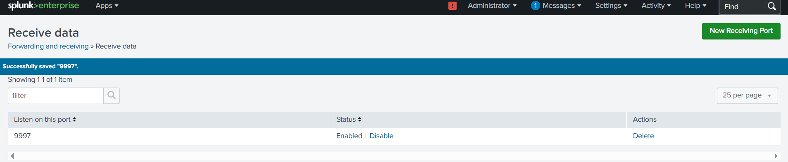

# Runbook: Splunk (SPL01) Build and Windows Event Log Forwarding
 
**Date:** July 19-20, 2026
**Author:** Duckboy-mr
 
## Objective
Stand up a Splunk Enterprise instance (SPL01) on Ubuntu Server, configure it to receive
forwarded Windows Event Logs from DC01 via a Universal Forwarder, and build a basic
dashboard for monitoring failed login attempts (Event ID 4625) — demonstrating a working
SIEM/log-forwarding pipeline end to end.
 
## Prerequisites
- VirtualBox installed
- Ubuntu Server ISO downloaded
- Host-only network configured (192.168.56.0/24)
- DC01 already built and domain-joined
## Architecture
- **SPL01**: Ubuntu Server, static IP `192.168.56.30`, runs Splunk Enterprise 10.2.0
- **DC01**: runs Splunk Universal Forwarder, sends Application/Security/System Windows
  Event Logs to SPL01 on TCP port 9997
## Steps
 
### SPL01 build
1. Created SPL01 VM in VirtualBox — Ubuntu Server, 1536 MB RAM, 20 GB dynamically
   allocated disk, host-only network adapter.
2. Installed Ubuntu Server, enabled OpenSSH server during setup for remote administration.
3. Set a static IP (192.168.56.30) via netplan (`/etc/netplan/00-installer-config.yaml`),
   since the installer only offered DHCP by default.
4. Connected via SSH (`ssh labadmin@192.168.56.30`) from the Windows host for all
   subsequent work — far more usable than the VM console for a Linux CLI workflow.
### Splunk install on SPL01
5. Downloaded the Splunk Enterprise `.deb` package (v10.2.0) directly from
   `download.splunk.com` on the Windows host (SPL01 has no internet route on the
   host-only network by design), then transferred it via `scp`.
6. Installed with `sudo dpkg -i splunk-10.2.0-*.deb`.
7. Started Splunk and configured the admin account (see Issues Encountered — this step
   required significant troubleshooting).
### Log forwarding setup
8. Enabled receiving on SPL01: Settings → Forwarding and receiving → Configure receiving
   → New Receiving Port → `9997`.
9. Downloaded the Splunk Universal Forwarder Windows installer on the Windows host
   (same no-internet-on-guest constraint as SPL01), transferred to DC01 via a VirtualBox
   Shared Folder (required installing Guest Additions on DC01 first).
10. Installed the Universal Forwarder on DC01, pointed it at `192.168.56.30:9997` as the
    receiving indexer during setup.
11. Configured `inputs.conf` on DC01 to collect Application, Security, and System
    Windows Event Logs (see Issues Encountered — the installer's GUI did not present a
    log-selection screen, so this required manual configuration).
12. Restarted the SplunkForwarder service to apply the new input configuration.
## Verification
- Generated a test failed login on DC01 (intentionally wrong password at the lock screen).
- Confirmed the event appeared in Splunk via `index=main EventCode=4625` search.
- Built a dashboard panel ("Failed Login Attempts by Username") visualizing the search
  as a bar chart, saved under a new "Security Monitoring" dashboard.

 
## Issues Encountered
 
1. **SPL01 root filesystem too small for the Splunk install.** Ubuntu's installer only
   allocated ~10GB of the 20GB virtual disk to the actual root LVM volume, leaving the
   rest unassigned. Splunk's install failed partway through with "No space left on
   device." Diagnosed via `df -h`, confirmed the volume group had unused free space via
   `vgs`, then extended the logical volume (`lvextend -l +100%FREE`) and resized the
   filesystem (`resize2fs`) to use the full disk. Install succeeded on retry.
2. **Splunk failed to start with a library version conflict.** Splunk 10.2.0's bundled
   OpenSSL library was incompatible with Ubuntu 26.04's newer systemd
   (`OPENSSL_3.4.0 not found`), and Splunk also refuses to run as root by default.
   Resolved by explicitly using the `--run-as-root` flag on start/stop commands. Noted as
   a deviation from best practice — production environments should run Splunk under a
   dedicated non-root service account rather than root.
3. **Splunk's interactive admin account setup silently failed over SSH.** The first
   `splunk start --accept-license` completed without error but never created an admin
   account or prompted for credentials — subsequent web UI logins failed with
   "no such user," then later "login failed," even after multiple attempts. Root cause:
   the SSH session was not being treated as a fully interactive TTY, so Splunk's setup
   script silently skipped the prompt rather than erroring. Resolved by stopping Splunk,
   deleting the incomplete `/opt/splunk/etc/passwd`, creating a `user-seed.conf` file
   under `/opt/splunk/etc/system/local/` with explicit `USERNAME`/`PASSWORD` values, and
   restarting with `--no-prompt` to force it to read the seed file instead of waiting on
   interactive input.
4. **Universal Forwarder direct download link 404'd initially.** The build hash used for
   the Enterprise `.deb` download did not match the Universal Forwarder package's own
   hash — each Splunk product/version combination has its own unique build identifier in
   its download URL. Resolved by searching for the correct hash specific to the
   Universal Forwarder release.
5. **DC01 has no internet access** (same host-only network isolation as SPL01), so the
   forwarder installer couldn't be downloaded directly on DC01. Resolved by downloading
   on the Windows host and transferring via a VirtualBox Shared Folder, which required
   installing Guest Additions on DC01 first (not previously needed for this VM).
6. **Universal Forwarder installer's GUI did not present a Windows Event Log selection
   screen**, despite this being expected per typical installer flow. Proceeded with
   default install, then configured log collection manually and directly by creating
   `inputs.conf` under `etc\system\local\` with explicit `WinEventLog` stanzas for
   Application, Security, and System.
7. **No forwarded data appeared in Splunk despite a successful TCP connection test**
   (`Test-NetConnection` to port 9997 returned `True`, and the forwarder's own log
   showed continuous successful connections to SPL01). Root cause: `inputs.conf` did not
   actually exist at the expected path — repeated attempts to create it via PowerShell
   failed silently due to a persistent typo (`SplunkUniveralForwarder` instead of
   `SplunkUniversalForwarder`) that caused every command referencing the path to target
   a nonexistent location. The forwarder was fully connected the entire time but had
   nothing configured to actually collect and send, since with no valid `inputs.conf` it
   was only forwarding Splunk's own internal tracker log by default. Resolved by
   navigating to the correct folder manually in File Explorer (avoiding retyped paths
   entirely) and creating the file there directly, saving via Notepad's "Save As" with
   "All Files" type selected (to avoid Windows silently appending `.txt`).
## Lessons Learned
 
A successful network/port connection test does not confirm an application is actually
doing anything useful — the forwarder connected to SPL01 successfully for over an hour
while sending no real data, because connectivity and configuration are two independent
things that both need to be verified separately. When a symptom (no forwarded data)
persists despite each individual layer checking out (port open, service running, GPO/
config apparently correct), the right move is to go to the actual source-of-truth log
file for that component (`splunkd.log` in this case) rather than continuing to test
symptoms from the outside — the forwarder's own log immediately showed it was only
reading its internal tracker file, which pointed straight at the real gap. Also learned
that typos in long file paths are a serious, repeat source of "file not found" errors
that look like configuration problems — when a command fails on a path that was
confirmed correct moments earlier, re-verify the exact path via tab-completion or a
directory listing rather than retyping it, since visual proofreading of long paths is
unreliable.