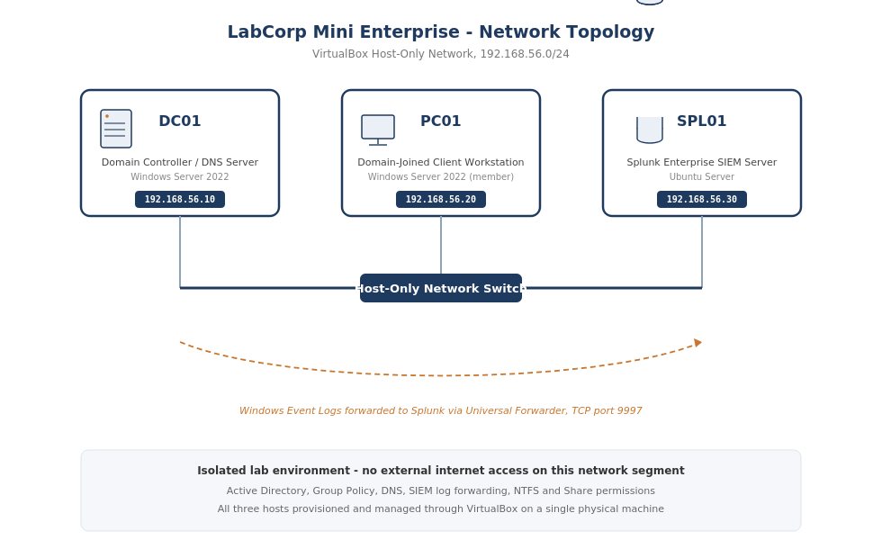
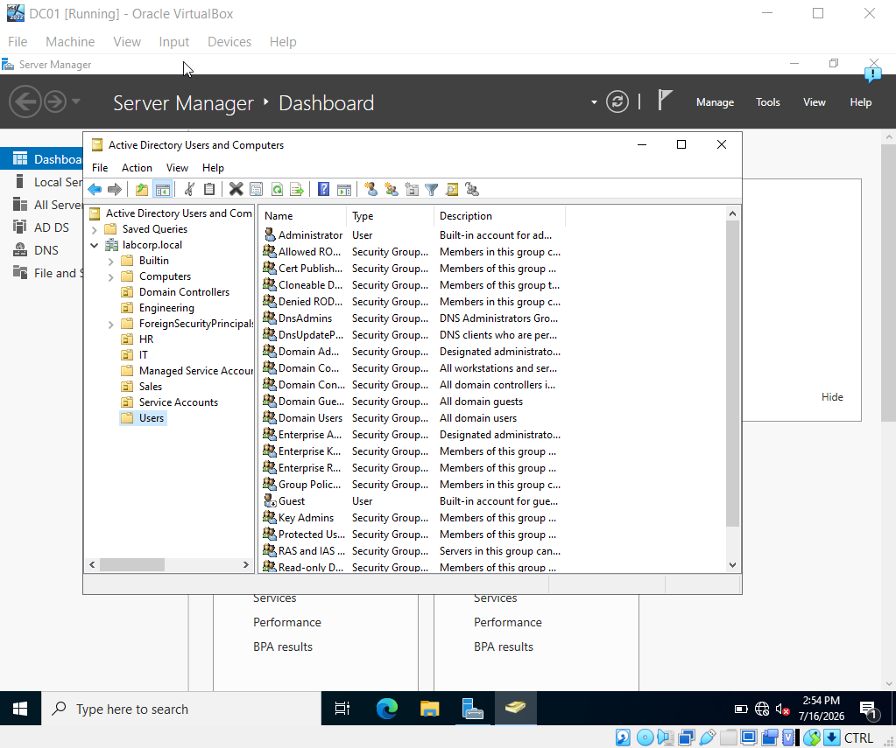

# Enterprise IT Infrastructure Environment

A fully virtualized enterprise environment demonstrating identity management, network services, and security operations administration.

## Components

| Host | Role | OS | IP Address |
|------|------|-----|------------|
| DC01 | Domain Controller / DNS Server | Windows Server 2022 | 192.168.56.10 |
| PC01 | Domain-Member Workstation | Windows Server 2022 (Desktop Experience) | 192.168.56.20 |
| SPL01 | Splunk Enterprise SIEM | Ubuntu Server | 192.168.56.30 |

**Network:** VirtualBox Host-Only Network (192.168.56.0/24)

*Note: PC01 was originally planned as Windows 10 but substituted with Windows Server 2022 Desktop Experience configured strictly as a domain member — no server roles installed, not promoted to a DC. Functionally equivalent for AD/GPO testing purposes.*

## Documentation

| Category | Contents |
|----------|----------|
| [`01-infrastructure`](01-infrastructure) | Network design, domain controller build, workstation provisioning |
| [`02-policies`](02-policies) | Group Policy deployment, SIEM log forwarding, security configurations |
| [`03-runbooks`](03-runbooks) | Operational procedures, troubleshooting guides, incident response |
| [`04-incidents`](04-incidents) | Documented investigations and root-cause analysis |
| [`05-tickets`](05-tickets) | Sample support tickets and resolution workflows |

## Key Demonstrations

**Identity & Access Management**
- Designed and administered a multi-OU Active Directory domain (`labcorp.local`) with role-based security groups
- Configured and enforced Group Policy Objects for password complexity, USB device restrictions, and user environment standardization

**Network Services**
- Deployed DNS services on Windows Server 2022
- Managed static IP allocation and name resolution for all infrastructure nodes

**Security Operations**
- Built a Splunk Enterprise SIEM pipeline ingesting Windows Event Logs via Universal Forwarder
- Created detection dashboards visualizing failed authentication attempts (Event ID 4625)

**Troubleshooting & Root Cause Analysis**
- Investigated and root-caused a Group Policy drive-mapping failure to a logon-time network race condition (Error 0x80070035); authored a comprehensive diagnostic write-up documenting the attempted remediation and the architectural limitation
- Resolved NTFS permission inheritance conflicts using systematic layer-by-layer verification (`dcdiag`, `gpresult`, Event Viewer)

## Screenshots
TEMP-THE SS WILL BE ADDED-
## Screenshots

**Network Topology**

**Active Directory OU Structure**

**Group Policy Management**

**Splunk Security Dashboard**

**Event Log Analysis**

**Domain Controller Health Check**

